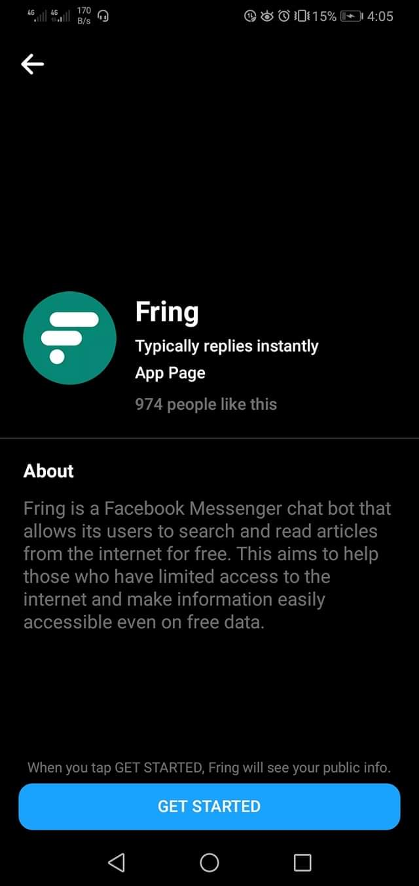
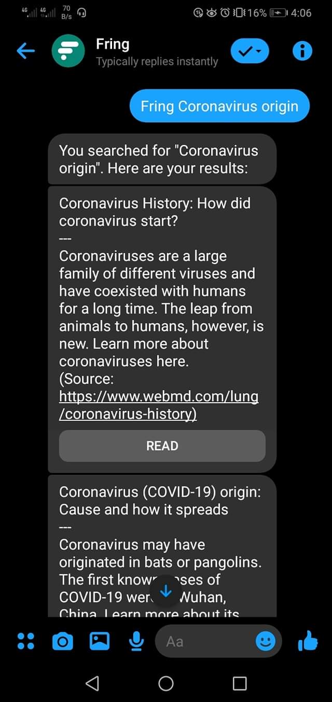
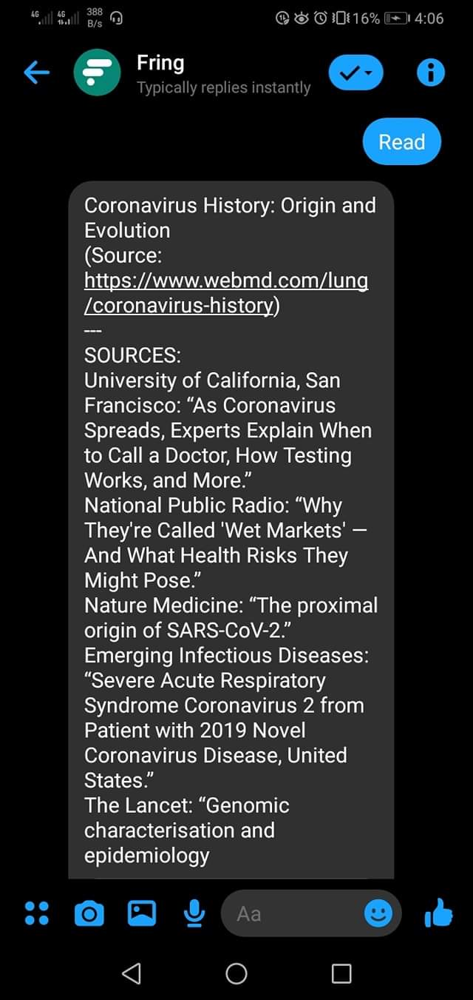
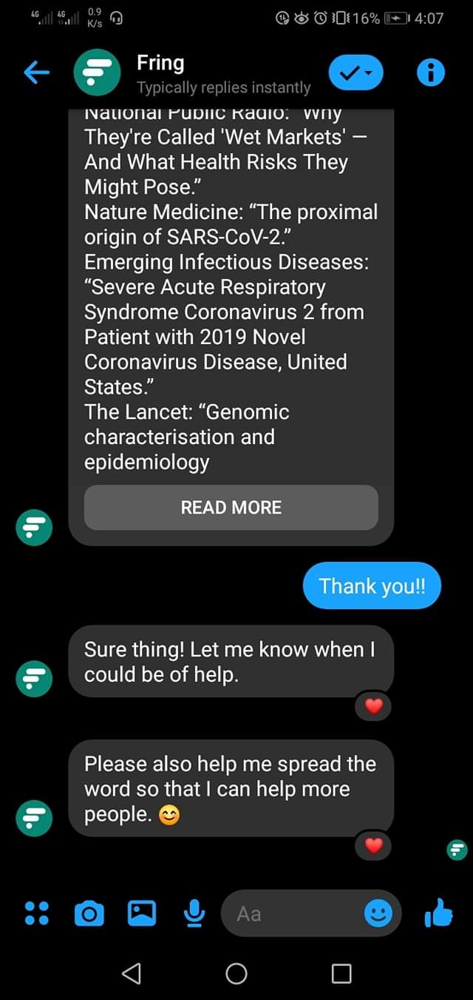

<h1 align="center">
     
    
     
     
    fring
</h1>
<h4 align="center">FB Messenger Chatbot for Searching the Web</h4>

### Dependencies
##### Bing Cognitive Services
In order to _legally_ create a search, Bing Search API under the [Bing Cognitive Services](https://azure.microsoft.com/en-us/services/cognitive-services/) was used. This takes use of Bing's search engine to return the results. Currently, the only way of using Google as the search engine is to scrape it manually which won't be sustainable in the long run because of Google's detection to bots.

##### Firebase
[Firebase](https://firebase.google.com/) was used as a means of data persistence. While a relational database is an option, Firebase was a primary choice to reduce costs of hosting the app.

##### Axios
To retrieve pages returned from the search, [axios](https://www.axios.com/) was used. Initially, [puppeteer](https://github.com/puppeteer/puppeteer) should be used but it takes more than 512 MB of memory. Check `next/puppeteer` branch for the implementation. Puppeteer was replaced with axios in order to reduce server cost.

### Screenshots

    
    
    
    

### Installation and Setup
1. Setup your environment with the following variables:
    - `ACCESS_TOKEN` - facebook app access token
    - `VERIFY_TOKEN` - random string for verification purposes
    - `APP_SECRET` - facebook app secret
    - `BING_ACCESS_KEY` - Bing cognitive services API key
    - `FIREBASE_API_KEY` - Firebase API key
    - `FIREBASE_DATABASE_URL` - Firebase database URL
2. Install node dependencies.
3. Start the development server with `yarn start`.

### Limitations
The bot cannot open or has limited support with:
- pages that are against [Facebook's Community Standards](https://www.facebook.com/communitystandards)
- client-side rendered pages
- pages with Shadow DOM
- sites not using semantic HTML

### Developer Contact
If you have any questions/suggestions, feel free to contact me at [rrsilaya@gmail.com](mailto://rrsilaya@gmail.com?subject=Inquiry%20on%20Fring).
